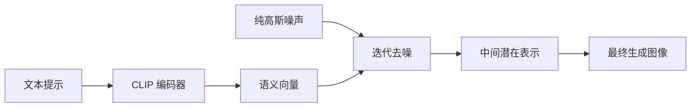

# ComfyUI 深度学习指南

## 目录
- [A. 核心概念](#a-核心概念)
- [B. 每种工作流类型的完整知识](#b-每种工作流类型的完整知识)
- [C. 高级技巧](#c-高级技巧)

---

## A. 核心概念

### 扩散模型原理（Latent Space vs Pixel Space）

**扩散模型**是 ComfyUI 的核心，基于反向扩散过程：从纯噪声逐步去噪生成目标图像。

#### Latent Space（潜在空间）vs Pixel Space（像素空间）

- **Pixel Space**：我们看到的最终图像，存储像素值的空间
- **Latent Space**：抽象的数据表示方法，相当于建筑师的蓝图
  - 优势：减少存储空间，降低去噪复杂度，便于训练扩散模型
  - 原理：保持结构特征的同时显著减少修改成本



### 节点系统（输入/输出/连接的数据类型）

ComfyUI 采用节点化工作流，每个节点有特定的输入输出类型：

#### 主要数据类型
- **MODEL**：扩散模型（UNet）
- **CLIP**：文本编码器
- **VAE**：变分自编码器
- **CONDITIONING**：条件控制数据
- **LATENT**：潜在空间图像
- **IMAGE**：像素空间图像
- **MASK**：遮罩数据
- **CONTROLNET**：控制网络模型

### 采样过程（KSampler 参数详解）

**KSampler** 是整个工作流的核心，执行噪声去噪过程：

#### 关键参数详解

| 参数 | 含义 | 推荐范围 | 调参技巧 |
|------|------|----------|----------|
| **steps** | 去噪迭代次数 | 20-50 | 更多步骤=更细节，但处理时间更长 |
| **cfg** | 分类器自由引导尺度 | 3.5-15 | 低=自由创作，高=严格遵循prompt |
| **sampler** | 采样算法 | euler/dpmpp_2m_sde | euler=快速，dpmpp_2m_sde=质量好 |
| **scheduler** | 调度器 | karras/normal | karras=推荐，normal=默认 |
| **denoise** | 去噪强度系数 | 0.3-1.0 | 0.3=轻微修改，0.5=中等，1.0=完全重新生成 |
| **seed** | 随机种子 | 任意整数 | 固定种子=可重复结果 |

### Checkpoint vs UNet vs CLIP vs VAE 的区别

#### Checkpoint（检查点）
- **定义**：包含完整模型的文件，通常包含 UNet、CLIP、VAE 三个组件
- **用途**：一次性加载完整的图像生成能力

#### UNet（模型核心）
- **定义**：负责噪声预测和图像生成的扩散模型
- **用途**：执行实际的去噪过程

#### CLIP（文本编码器）
- **定义**：将文本提示转换为模型可理解的语义向量
- **用途**：理解和编码 prompt

#### VAE（变分自编码器）
- **定义**：在像素空间和潜在空间之间转换
- **用途**：编码（像素→潜在）和解码（潜在→像素）

---

## B. 每种工作流类型的完整知识

### 1. Text2Img（文本生图）

#### 原理
纯文本驱动的图像生成，从随机噪声开始，根据文本提示逐步去噪生成图像。

#### 必要节点
- **CheckpointLoaderSimple**：加载预训练模型
- **CLIPTextEncode** × 2：编码正面和负面提示
- **EmptyLatentImage**：创建噪声画布
- **KSampler**：执行去噪采样
- **VAEDecode**：转换为像素图像
- **SaveImage**：保存结果

#### 数据流
```
Checkpoint → MODEL/CLIP/VAE
文本 → CLIP → CONDITIONING → KSampler
EmptyLatent → KSampler → LATENT → VAE → IMAGE
```

#### 关键参数
- **分辨率**：512×512 (SD1.5), 1024×1024 (SDXL), 自定义 (Flux)
- **CFG**：7-12 适合大多数场景
- **Steps**：20-30 步通常足够

#### 常见模型
- **SD1.5**：v1-5-pruned-emaonly-fp16.safetensors
- **SDXL**：高分辨率专用
- **Flux**：最新一代模型

#### API Format JSON 示例
```json
{
  "3": {
    "inputs": {
      "seed": 42,
      "steps": 25,
      "cfg": 7.5,
      "sampler_name": "euler",
      "scheduler": "normal",
      "denoise": 1,
      "model": ["4", 0],
      "positive": ["6", 0],
      "negative": ["7", 0],
      "latent_image": ["5", 0]
    },
    "class_type": "KSampler"
  },
  "4": {"inputs": {"ckpt_name": "v1-5-pruned-emaonly-fp16.safetensors"}, "class_type": "CheckpointLoaderSimple"},
  "5": {"inputs": {"width": 512, "height": 512, "batch_size": 1}, "class_type": "EmptyLatentImage"},
  "6": {"inputs": {"text": "masterpiece, best quality, a beautiful girl", "clip": ["4", 1]}, "class_type": "CLIPTextEncode"},
  "7": {"inputs": {"text": "low quality, blurry", "clip": ["4", 1]}, "class_type": "CLIPTextEncode"},
  "8": {"inputs": {"samples": ["3", 0], "vae": ["4", 2]}, "class_type": "VAEDecode"},
  "9": {"inputs": {"filename_prefix": "ComfyUI", "images": ["8", 0]}, "class_type": "SaveImage"}
}
```

### 2. Img2Img（图生图）

#### 原理
基于参考图像的再创作，通过控制去噪强度实现风格转换或细节调整。

#### 必要节点
- **CheckpointLoaderSimple**：加载模型
- **LoadImage**：加载参考图像
- **VAEEncode**：编码参考图像到潜在空间
- **CLIPTextEncode** × 2：编码提示
- **KSampler**：执行采样（denoise < 1.0）
- **VAEDecode** + **SaveImage**：输出结果

#### 数据流
```
参考图像 → VAE编码 → LATENT → KSampler → 新LATENT → VAE解码 → 结果图像
```

#### 关键参数
- **denoise**：0.3（轻微修改）→ 0.8（大幅改动）
- **CFG**：通常比 Text2Img 稍低（5-10）

#### API Format JSON 示例
```json
{
  "3": {
    "inputs": {
      "seed": 42,
      "steps": 25,
      "cfg": 6.5,
      "sampler_name": "euler",
      "scheduler": "normal",
      "denoise": 0.65,
      "model": ["4", 0],
      "positive": ["6", 0],
      "negative": ["7", 0],
      "latent_image": ["10", 0]
    },
    "class_type": "KSampler"
  },
  "10": {"inputs": {"pixels": ["11", 0], "vae": ["4", 2]}, "class_type": "VAEEncode"},
  "11": {"inputs": {"image": "input.jpg", "upload": "image"}, "class_type": "LoadImage"}
}
```

### 3. LoRA（低秩适应）

#### 原理
通过低秩矩阵微调预训练模型，实现特定风格或概念的图像生成。

#### 必要节点
- **CheckpointLoaderSimple**
- **LoadLoRA**：加载并应用 LoRA
- 标准 Text2Img 流程

#### 数据流
```
Checkpoint → LoadLoRA → 调整后的MODEL/CLIP → 正常流程
```

#### 关键参数
- **strength_model**：0.5-1.2（模型权重影响强度）
- **strength_clip**：0.5-1.2（文本编码影响强度）

#### 链式连接
多个 LoRA 可串联使用：
```
Checkpoint → LoRA1 → LoRA2 → LoRA3 → KSampler
```

### 4. Inpaint（局部重绘）

#### 原理
通过 mask 指定需要重绘的区域，只对蒙版区域进行重新生成。

#### 必要节点
- **CheckpointLoaderSimple**（推荐使用 inpainting 专用模型）
- **LoadImage**：原始图像
- **VAEEncodeForInpainting**：专用编码器
- **KSampler** + **VAEDecode** + **SaveImage**

#### 数据流
```
原始图像+Mask → VAEEncodeForInpainting → LATENT → KSampler → 修复结果
```

#### 关键参数
- **grow_mask_by**：扩展蒙版边缘，避免硬边界
- **denoise**：通常设为 1.0（完全重绘蒙版区域）

#### 推荐模型
- **512-inpainting-ema.safetensors**：专为 inpainting 优化

### 5. Outpaint（画布扩展）

#### 原理
扩展图像边界，生成原图像外围的内容。

#### 必要节点
- **CheckpointLoaderSimple**
- **LoadImage**
- **PadImageForOutpainting**：构建扩展蒙版
- **VAEEncodeForInpainting** + 标准流程

#### 关键参数
- **left/top/right/bottom**：各方向扩展像素数
- **feathering**：边缘羽化，创建平滑过渡

### 6. Upscale（超分辨率）

#### 三种方法对比

#### 模型法（推荐）
- **节点**：LoadUpscaleModel + UpscaleImageUsingModel
- **优势**：质量最高，细节重建好
- **推荐模型**：4x-ESRGAN、RealESRGAN、BSRGAN

#### Latent法
- **节点**：LatentUpscale + KSampler
- **优势**：可控性强，能结合文本提示
- **用途**：需要在放大同时调整内容

#### 像素法
- **节点**：ImageUpscaleWithModel
- **优势**：速度快，内存占用低
- **用途**：简单放大，不需要细节增强

#### 链式放大
```
原图 → 2x放大 → 4x放大 = 最终8x
```

### 7. ControlNet（精确控制）

#### 支持的控制类型

#### Canny 边缘检测
- **用途**：线稿控制，保持轮廓
- **预处理**：自动检测边缘

#### Depth 深度控制
- **用途**：构图控制，景深管理
- **预处理**：深度估计算法

#### Pose 姿态控制
- **用途**：人体姿态控制
- **预处理**：关键点检测

#### Scribble 草图控制
- **用途**：手绘草图指导
- **预处理**：线条简化

#### 必要节点
- **LoadControlNet**：加载控制模型
- **ApplyControlNet**：应用控制条件
- 标准生成流程

#### 关键参数
- **strength**：控制强度（0.5-1.5）
- **start_percent**：开始应用时机（0.0-0.3）
- **end_percent**：结束应用时机（0.7-1.0）

### 8. 多 ControlNet 混合

#### 串联连接
```
Positive → ControlNet1 → ControlNet2 → ControlNet3 → KSampler
```

#### 权重分配策略
- **主控制**：strength = 1.0-1.2
- **辅助控制**：strength = 0.6-0.8
- **微调控制**：strength = 0.3-0.5

### 9. Flux 模型系列

#### 特点
- **更高分辨率支持**
- **更好的文本理解**
- **改进的采样器链路**

#### 专用节点
- **CLIPTextEncodeFlux**：Flux 专用文本编码
- **FluxGuidance**：引导控制
- **ModelSamplingFlux**：采样配置

#### 推荐参数
- **guidance**：3.5-4.0
- **max_shift**：1.15
- **base_shift**：0.5

### 10. 视频生成

#### 支持的模型
- **Wan2.x**：阿里巴巴通义万象
- **LTX Video**：高质量视频合成
- **CogVideoX**：清华大学方案
- **HunyuanVideo**：腾讯混元

#### 基础流程
```
文本/图像 → 视频模型 → 视频潜在表示 → 解码 → 视频文件
```

### 11. 3D 生成

#### HunyuanDiT 3D
- **输入**：文本描述或参考图像
- **输出**：3D mesh 模型
- **格式**：支持多种 3D 文件格式

### 12. 音频生成

#### 支持类型
- **文本转语音**（TTS）
- **音乐生成**
- **音效合成**

---

## C. 高级技巧

### SD1.5 vs SDXL vs Flux 的区别和选择

#### SD1.5
- **分辨率**：512×512 原生
- **特点**：模型丰富，LoRA 多，社区活跃
- **适用**：快速原型，风格化创作

#### SDXL
- **分辨率**：1024×1024 原生
- **特点**：细节更丰富，文本理解更好
- **适用**：高质量输出，商业用途

#### Flux
- **分辨率**：灵活可调
- **特点**：最新技术，质量最高
- **适用**：前沿实验，专业制作

### denoise 强度对图生图的影响

| 数值 | 效果 | 适用场景 |
|------|------|----------|
| 0.1-0.3 | 轻微调整 | 细节优化，色彩调整 |
| 0.4-0.6 | 中等修改 | 风格迁移，局部改动 |
| 0.7-0.9 | 大幅改动 | 重新构图，主题变换 |
| 1.0 | 完全重生成 | 仅保留尺寸，内容全新 |

### CFG 的作用机制

#### 低 CFG（1-5）
- **特点**：AI 自由发挥
- **效果**：创意性强，随机性高
- **风险**：可能偏离提示

#### 中 CFG（6-10）
- **特点**：平衡控制
- **效果**：稳定输出，符合预期
- **推荐**：日常使用

#### 高 CFG（11-20）
- **特点**：严格遵循
- **效果**：高度符合提示
- **风险**：可能过饱和，细节丢失

### 采样器选择指南

#### 速度优先
- **euler**：最快，适合测试
- **euler_ancestral**：稍慢，质量提升

#### 质量优先
- **dpmpp_2m_sde**：高质量，推荐
- **dpmpp_3m_sde**：更高质量，更慢

#### 平衡选择
- **uni_pc**：速度质量平衡
- **heun**：稳定可靠

### 调度器选择

#### karras
- **特点**：噪声调度优化
- **效果**：更好的细节保持
- **推荐**：默认选择

#### normal
- **特点**：标准线性调度
- **效果**：稳定可预测
- **用途**：兼容性要求

#### exponential
- **特点**：指数衰减
- **效果**：特殊艺术效果
- **用途**：实验性创作

### 组合技术实战

#### ControlNet + LoRA 组合
```
参考姿态图 → Pose ControlNet → 风格 LoRA → 最终输出
```
**应用**：保持姿态的同时改变风格

#### Inpaint + Upscale 流水线
```
原图 → 局部修复 → 整体放大 → 细节增强
```
**应用**：高质量图像修复工作流

#### 多 LoRA 叠加策略
- **基础风格 LoRA**：strength = 0.8-1.0
- **细节 LoRA**：strength = 0.4-0.6  
- **色调 LoRA**：strength = 0.2-0.4

#### 渐进式生成
```
Text2Img (512×512) → Img2Img (1024×1024) → Upscale (2048×2048)
```
**优势**：逐步提升质量，避免显存不足

---

## 调试与优化技巧

### 常见问题解决

#### 显存不足
- 降低批处理大小
- 使用 FP16 模型
- 启用 CPU offload

#### 生成质量差
- 调整 CFG 和采样步数
- 优化 prompt 质量
- 尝试不同采样器

#### 速度过慢
- 使用快速采样器
- 减少采样步数
- 优化模型加载

### 性能优化
- **模型预加载**：避免重复加载
- **批处理**：提高 GPU 利用率
- **内存管理**：及时清理无用变量

---

这份指南涵盖了 ComfyUI 的核心知识，从基础概念到高级应用。通过理解这些原理和技巧，你可以更好地掌握 AI 图像生成的精髓，创造出令人满意的作品。